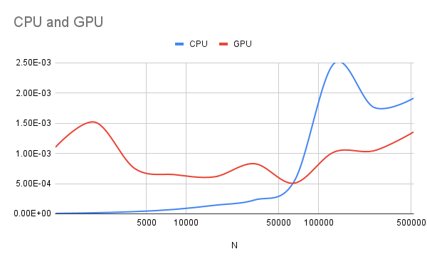
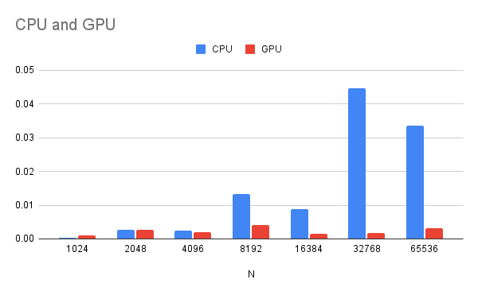

*How is the communication between the host and the graphic card handled?*
By using the OpenCL API calls.

For example
`` `c++`
context = clCreateContext(0, 1, &device_id, NULL, NULL, &err);
``
creates the context environment for the OPENCL program, where the host (e.g CPU) and the device (e.g the GPU) can communicate with each other.
*What function executes your kernel?*
The kernel will execute the  ```c++´clEnqueueNDRangeKernel()´´ API-call. 
*How does the kernel know what element to work on?*
By reading the buffer we have created between the host and the device. 

Creation of the buffers:

Reading the buffer: 
`` `c++`
	err = clEnqueueReadBuffer( commands, output, CL_TRUE, 0, sizeof(char) * count, c, 0, NULL, NULL );  
``
Setting up the buffer and sending it to the device: 
`` `c++`
	input = clCreateBuffer(context,  CL_MEM_READ_ONLY | CL_MEM_USE_HOST_PTR,  sizeof(char) * DATA_SIZE, a, NULL);
``
*What timing did you get for your GPU reduction? Compare it to the CPU version.*
For the default size we got the following result:
CPU 0.000007
GPU reduction.
GPU 0.001308


*Try larger data size. On what size does the GPU version get faster, or at least comparable, to the CPU?*
From N= 1024*64 


*How can you optimize this further? You should know at least one way.*
So, according to the book, we should do the parts where the GPU is faster, where we can parelize it a lot, on the GPU. Then to the last part on the CPU.

*Should each thread produce one output or two? Why?*
Each thread should produce two outputs, because we are swapping two values in each work item. 

*How many items can you handle in one workgroup?*
1024. Because we set the localWorkSize to 512 or the number of threads, whichever is the smallest. Because each workSize contains to workGroups, the maximal items in one WorkGroup is 1024.
*What problem must be solved when you use more than one workgroup? How did you solve it?*
Synchronization and coordination among different workgroups. We don't think we have solved it?

*What time do you get? Difference to the CPU? What is the break even size? What can you expect for a parallel CPU version? (Your conclusions here may vary between the labs.)*
4096 is the break even size. Probably faster then the single core? Maybe even then the GPU because not needing to copy memory here and there?

